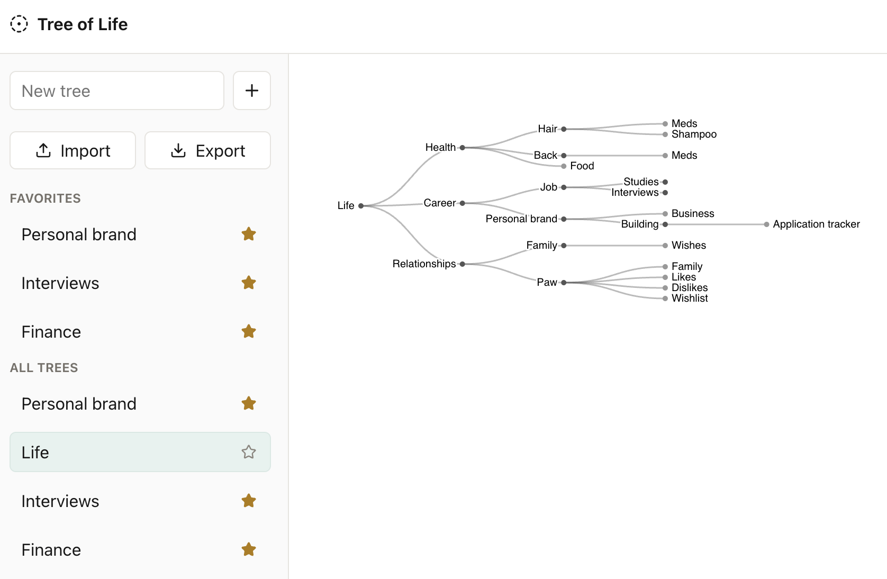

# Tree of Life



Minimal, responsive tree editor with Google sign-in, guest mode, and a D3 collapsible tree inspired by Mike Bostock's Observable reference.

## Stack

- React + TypeScript + Vite
- D3 for SVG tree layout, joins, and transitions
- Zustand for app state
- Firebase Auth + Firestore for signed-in persistence
- IndexedDB for guest persistence

## Setup

```bash
npm install
cp .env.example .env
npm run dev
```

Populate `.env` with a Firebase web app config if you want Google login and cloud sync. Guest mode works without Firebase config.

## Scripts

```bash
npm run dev
npm run build
npm run test
npm run lint
```

## Firebase

Expected Firestore path:

```txt
users/{uid}/trees/{treeId}
```

Recommended security rule shape:

```txt
match /users/{uid}/trees/{treeId} {
  allow read, write: if request.auth != null && request.auth.uid == uid;
}
```

## Interaction

- Click a node to expand or collapse its subtree.
- Right-click on desktop, or long press on mobile, to open node actions.
- Use "View as root" to focus a subtree.
- Use "Back to Tree of Life" to return to the original root.

## Formula Node Names

Node names can include basic LaTeX-style formulas. Wrap inline formulas with `$...$` or `\(...\)`, and use `$$...$$` or `\[...\]` for display-style formulas.

Examples:

```txt
Energy $E=mc^2$
Sequence $x_1, x_2, x_3$
Ratio $\frac{a+b}{c}$
Distance $\sqrt{x^2 + y^2}$
Greek $\alpha + \beta \le \gamma$
Limit $\lim_{n \to \infty} a_n$
Prediction $\hat y_i$
Gradient $g=\frac{1}{N}\sum_{i=1}^{N}\nabla_{\theta}L_i(\theta),\quad \theta_{t+1}=\theta_t-\eta g$
```

Supported fundamentals include:

- Superscripts: `$x^2$`, `$e^{i\pi}$`
- Subscripts: `$x_1$`, `$a_{n+1}$`
- Accents: `$\hat y_i$`
- Fractions: `$\frac{numerator}{denominator}$`
- Square roots: `$\sqrt{x+y}$`
- Greek letters: `\alpha`, `\beta`, `\gamma`, `\Delta`, `\Omega`
- Spacing: `\quad`
- Common operators: `\times`, `\cdot`, `\pm`, `\le`, `\ge`, `\neq`, `\approx`, `\to`, `\infty`, `\sum`, `\int`
